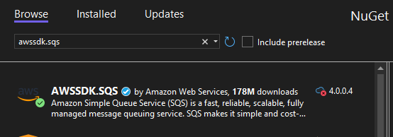
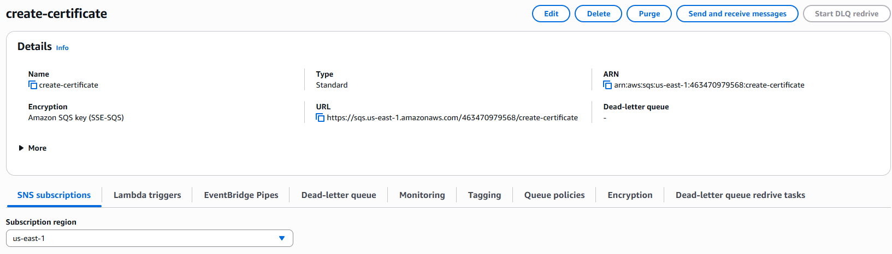
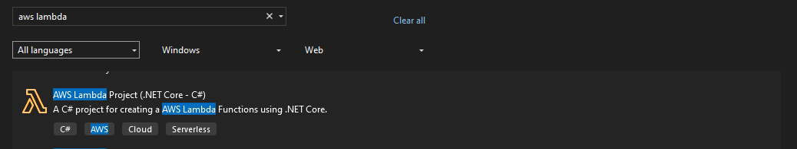
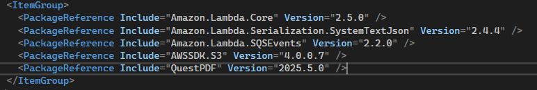
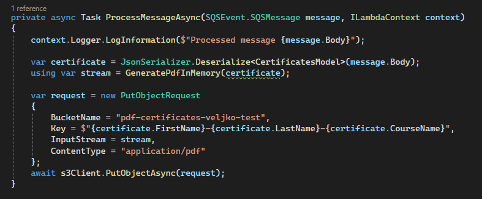
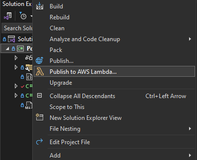
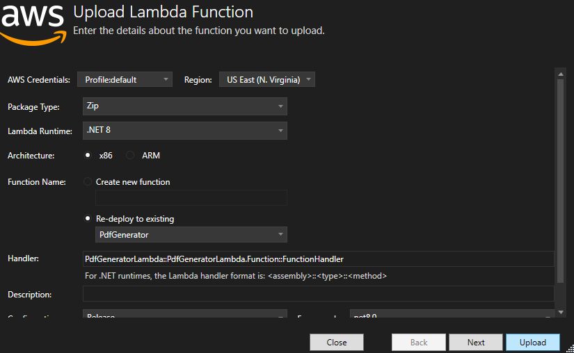
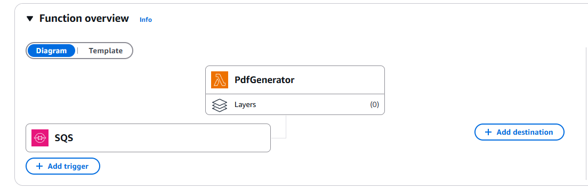

# AWS-tutorial

## Svrha tutorijala:

Ovaj tutorijal pruža praktični uvod u AWS (Amazon Web Services) i njegove mogućnosti za kreiranje skalabilnih, distribuiranih i serverless sistema. Kroz konkretan primer, u kom se poruke šalju putem SQS reda, obrađuju u Lambda funkciji i rezultati skladište u S3 bucket-u, čitalac će naučiti:

1. Kako da projektuje i implementira serverless arhitekturu koristeći AWS servise.

2. Na koji način SQS omogućava pouzdanu i asinhronu komunikaciju između komponenti sistema.

3. Kako da koristi AWS Lambda funkcije za obradu događaja bez potrebe za održavanjem servera.

4. Kako da koristi S3 kao trajnu memoriju za skladištenje rezultata ili fajlova.

## Problem koji AWS rešava

Moderne veb aplikacije zahtevaju skalabilnu, pouzdanu i bezbednu infrastrukturu koja omogućava brz razvoj, automatsko upravljanje resursima, monitoring i jednostavnu integraciju sa različitim servisima. Tradicionalno hostovanje na fiksnim serverima često dovodi do:

- Nemogućnosti brzog skaliranja u skladu sa rastućim brojem korisnika  
- Visokih troškova infrastrukture  
- Komplikovanog procesa obezbeđivanja resursa i upravljanja bezbednošću  
- Nedostatka vidljivosti i alata za praćenje rada aplikacije u realnom vremenu  

Ovaj problem je naročito izražen kod aplikacija koje se razvijaju u mikroservisnoj arhitekturi, koriste više baza podataka, zahtevaju asinhronu komunikaciju i moraju biti visoko dostupne.

## Zašto AWS?

AWS predstavlja kompletno cloud rešenje koje omogućava izgradnju, deploy i skalabilnost aplikacija uz minimalnu konfiguraciju i troškove održavanja. Korišćenjem servisa kao što su:

- **AWS Lambda** – za serverless arhitekturu i izvršavanje koda bez upravljanja serverima  
- **Amazon S3** – za pouzdano čuvanje statičkih fajlova i medija  
- **Amazon SQS** – za asinhronu komunikaciju između mikroservisa  
- **AWS Secrets Manager** – za bezbedno upravljanje poverljivim podacima  
- **IAM i VPC** – za kontrolu pristupa i izolaciju mrežnog okruženja  

AWS omogućava izuzetno brz i stabilan razvoj aplikacije, uz mogućnost lakog praćenja i automatskog prilagođavanja opterećenju.

U odnosu na konkurentna rešenja, AWS nudi:

- Najveći broj dostupnih servisa  
- Bolju dokumentaciju i podršku za početnike  
- Širi free tier pogodan za učenje i prototipiranje  

---

### Poređenje sa Microsoft Azure

| Aspekt                     | AWS                                           | Azure                                              |
|---------------------------|-----------------------------------------------|----------------------------------------------------|
| **Integracija**           | Platformno neutralan (Linux, open-source)     | Odlična integracija sa Microsoft alatima (Windows, Active Directory, Office 365) |
| **Serverless**            | AWS Lambda – fleksibilniji i zreliji          | Azure Functions – lakši za početnike               |
| **Mrežni servisi**        | Veća fleksibilnost, niža latencija            | Stabilni ali manje prilagodljivi                   |
| **Mašinsko učenje**       | AWS SageMaker – moćniji za napredne projekte  | Azure ML – jednostavniji za osnovne scenarije     |
| **Cenovni model**         | Detaljan, ali kompleksan                      | Jednostavniji za korisnike iz Windows ekosistema   |
| **Free tier za učenje**   | Opširniji i trajniji (neki servisi zauvek)    | Ograničeniji i vremenski kraći                     |

---

AWS je izabran jer pruža kompletnu infrastrukturu koja omogućava brz, bezbedan i moderan razvoj aplikacije u cloud okruženju.

### Servisi korišćeni u ovom tutorijalu


U okviru ovog tutorijala koristićemo tri osnovna AWS servisa koji zajedno omogućavaju kreiranje skalabilnog i serverless sistema: **Amazon SQS**, **AWS Lambda**, i **Amazon S3**. U nastavku je detaljan opis svakog od njih.

---
#### 📬 Amazon SQS (Simple Queue Service)

Amazon SQS je **fully managed** servis za razmenu poruka između komponenti sistema. Pruža mogućnost da jedan servis pošalje poruku u red, dok drugi servis (npr. Lambda funkcija ili neki ECS servis) može tu poruku da pročita i obradi – sve to bez direktne međuzavisnosti između tih komponenti.

**Osnovne karakteristike:**
- Decoupling (razdvajanje) servisa – omogućava nezavisno skaliranje i razvoj različitih delova sistema.
- Pouzdana isporuka poruka – garantuje da nijedna poruka neće biti izgubljena (uz pravilno konfigurisane retry mehanizme).
- Podržava FIFO redove za garantovani redosled poruka.
- Jednostavno podešavanje prava pristupa i bezbednosti putem IAM politika.
---
#### ⚙️ AWS Lambda

AWS Lambda omogućava izvršavanje funkcija u cloudu **bez potrebe za upravljanjem serverima**. Dovoljno je napisati kod za Lambda funkciju, definisati trigger i AWS se brine o svemu ostalom – skaliranju, održavanju, resursima i naplati.

**Osnovne karakteristike:**
- Potpuno serverless – korisnik ne brine o infrastrukturi.
- Automatsko skaliranje – Lambda funkcije se pokreću on-demand za svaku poruku.
- Integracija sa brojnim AWS servisima – uključujući SQS, S3, API Gateway i druge.
- Naplata po broju poziva i trajanju izvršavanja funkcije.
---

#### 🗂️ Amazon S3 (Simple Storage Service)

Amazon S3 je skalabilni sistem za skladištenje podataka koji omogućava čuvanje bilo koje vrste fajlova – od tekstualnih dokumenata i slika, do logova i binarnih podataka.

**Osnovne karakteristike:**
- Visoka dostupnost i otpornost na greške (objekti se čuvaju redundantno).
- Skalabilnost bez potrebe za manuelnim podešavanjem kapaciteta.
- Verzionisanje i kontrola pristupa.
- Jednostavna integracija sa drugim AWS servisima, uključujući Lambda, CloudFront, Athena i druge.
---

## Upotreba servisa u projektu 


- U konzolnoj C# applikaciji korisnik unosi podatke za generisanje sertifikata (informacije o polazniku kursa i naziv kursa).
- Unete podatke aplikacije šalje na queue pod nazivom create-certificate-queue.
- Kako poruka pristigne na queue trigeruje se PdfGeneratorLambda.
- Lambda uz pomoć QuestPDF biblioteke generiše pdf fajl.
- Kreira se ime fajla kao (firstName-LastName-courseName)
- Fajl se zatim stoje na S3 bucket "pdf-certificates-veljko-test"

## Pokretanje aplikacije i pravljenje servisa

Da biste uspešno pokrenuli aplikaciju i postavili neophodne servise, potrebno je da imate AWS nalog. U nastavku su opisani svi koraci koje je potrebno uraditi:

### 1. Kreiranje besplatnog (Free Tier) naloga na AWS-u

1. Posetite [https://aws.amazon.com/free](https://aws.amazon.com/free).
2. Kliknite na **Create a Free Account**.
3. Popunite tražene podatke: ime, email, lozinku i naziv naloga.
4. Unesite podatke o kreditnoj kartici (neće biti naplaćeni dok ste u okviru Free Tier-a).
5. Izaberite osnovni plan (**Basic Support**).

### 2. Podešavanje višefaktorske autentifikacije (MFA)

Zbog bezbednosti, preporučuje se da odmah nakon kreiranja naloga podesite MFA:

1. Prijavite se na **AWS Management Console**.
2. Idite na **IAM** servis.
3. U meniju sa leve strane izaberite **Users**, zatim kliknite na svoje korisničko ime.
4. Kliknite na **Security credentials** tab.
5. U sekciji **Multi-factor authentication (MFA)** kliknite na **Assign MFA device**.
6. Izaberite **Virtual MFA device** i pratite uputstvo:
   - Preuzmite aplikaciju kao što je Google Authenticator ili Authy.
   - Skenirajte QR kod i unesite dva uzastopna koda za potvrdu.

### 3. Kreiranje Access Key i Secret Key vrednosti

Da biste omogućili CLI pristup aplikaciji, potrebno je kreirati **Access Key**:

1. Idite na **IAM** > **Users** > vaše korisničko ime > **Security credentials**.
2. U sekciji **Access keys** kliknite na **Create access key**.
3. Izaberite **Application running outside AWS**.
4. Na sledećem koraku kopirajte:
   - **Access key ID**
   - **Secret access key** (⚠️ *ova vrednost je prikazana samo jednom!*)

> 🔐 **Napomena:** Obavezno odmah sačuvajte `Secret access key` lokalno (npr. u `.env` fajlu ili u password manager-u). AWS ne omogućava ponovni prikaz ove vrednosti!

### 4. Konfigurisanje AWS CLI

Instalirajte AWS CLI ako već nije instaliran. Potom pokrenite sledeću komandu u terminalu:

```bash
aws configure
```
Unesite odgovarajuće vrednosti kao što je prikazano na slici ispod.


### 5. Instalacija Visual Studio-a, .NET SDK-a i AWS ekstenzije

Da biste mogli da razvijate i pokrenete aplikaciju lokalno, potrebno je da instalirate sledeće:

1. Preuzmite i instalirajte **Visual Studio** sa [https://visualstudio.microsoft.com](https://visualstudio.microsoft.com)
   - Tokom instalacije, obavezno izaberite workload **ASP.NET and web development**.
2. Preuzmite i instalirajte **najnoviju verziju .NET SDK-a** sa [https://dotnet.microsoft.com/download](https://dotnet.microsoft.com/download)
3. Nakon instalacije Visual Studio-a, instalirajte i **AWS Toolkit for Visual Studio**:
   - Otvorite Visual Studio
   - Idite na **Extensions** > **Manage Extensions**
   - U pretrazi pronađite **AWS Toolkit for Visual Studio**
   - Kliknite na **Download** i restartujte Visual Studio kada se zatraži

> ✅ Nakon instalacije, proverite da li su .NET alati dostupni pokretanjem sledeće komande u terminalu:

```bash
dotnet --version
```

## Opis servisa i ključne karakteristike svakog servisa. 

### 1. CertificateServiceClient

`CertificateServiceClient` je jednostavna C# konzolna aplikacija čija je svrha da prikuplja podatke o sertifikatu i prosleđuje ih putem SQS reda poruka. Korisnik unosi podatke kroz komandnu liniju, a aplikacija ih obrađuje i šalje na AWS SQS red.

#### Koraci implementacije

---

#### 1. Instalacija AWS SDK paketa

Pre pokretanja aplikacije, neophodno je instalirati `AWSSDK.SQS` paket putem NuGet Package Manager-a. Na slici ispod prikazan je način instalacije u Visual Studio okruženju:



---

#### 2. Program.cs fajl

Fajl Program.cs sadrži glavnu logiku aplikacije:

- Korisnik unosi podatke o sertifikatu: ime, prezime, naziv kursa, datum itd.
- Ukoliko `SecretKey` i `AccessKey` nisu prethodno učitani, aplikacija ih učitava iz lokalnog fajla.
- Zatim se kreira instanca `PublishService` klase, kojoj se kroz konstruktor prosleđuje instanca `AmazonSQSClient`.
- `AmazonSQSClient` se kreira sa pristupnim ključevima (`AccessKey`, `SecretKey`) i definisanim AWS regionom.
- Kreira se model sertifikata i poziva metoda `Publish`, koja šalje podatke na red.

---


#### 3. PublishCertificate.cs fajl

Fajl PublishCertificateService implementira logiku za slanje poruke na AWS SQS:

- Kroz konstruktor prima interfejs `IAmazonSQS`.
- Model sertifikata se serijalizuje u JSON format.
- Kreira se instanca `SendMessageRequest` koja sadrži JSON podatke i URL ciljnog reda.
- Poruka se šalje na AWS SQS red pomoću metode `SendMessageAsync`.

---

#### 4. Kreiranje AWS SQS reda

Pre nego što aplikacija može da šalje poruke, neophodno je da se na AWS-u kreira red (queue) koji će služiti za prijem sertifikata.

- Otvori AWS Management Console i idi na **Amazon SQS** servis.
- Klikni na dugme **"Create queue"**.
- Izaberi **Standard** tip reda.
- Kao ime reda unesi npr. `create-certificate`.
- Ostatak podešavanja može ostati podrazumevan, osim ako ti nisu potrebne dodatne opcije (npr. politika pristupa).

Nakon kreiranja, kopirati URL novog reda jer će biti potreban u kodu za slanje poruka.



### PdfGeneratorLambda

`PdfGeneratorLambda` je AWS Lambda funkcija koja se aktivira kada se pošalje poruka u red `create-certificate`. Njena uloga je da obradi primljenu poruku, generiše PDF fajl i sačuva ga na Amazon S3.

---

#### 1. Kreiranje projekta

Potrebno je kreirati novi .NET projekat kao što je prikazano na slici:



---

#### 2. Instalacija paketa

Za potrebe ove Lambda funkcije, potrebno je instalirati sledeće NuGet pakete:



---

#### 3. Implementacija funkcije

Glavna logika Lambda funkcije obuhvata sledeće korake:

- Deserijalizacija poruke primljene sa SQS reda
- Generisanje PDF fajla
- Kreiranje request-modela za slanje fajla na Amazon S3

Primer funkcije prikazan je na slici:



---

#### 4. Deploy Lambda funkcije

1. Desnim klikom na projekat odaberi opciju **"Publish to AWS Lambda"**:

   

2. U sledećem koraku unesi ime Lambda funkcije i izvrši deploy. Ukoliko deploy ne uspe iz prvog pokušaja, koristi opciju **"Redeploy"**:

   

---

#### 5. Dodavanje SQS triger-a

Nakon što je Lambda funkcija uspešno deployovana, potrebno je dodati triger koji će aktivirati ovu funkciju. U našem slučaju, to je **SQS red**:



---

#### 6. Kreiranje S3 bucketa

Lambda funkcija će čuvati generisane PDF fajlove u **Amazon S3 bucket-u**. Za kreiranje bucketa:

- Otvoriti **S3 servis** u AWS konzoli
- Kliknuti na **"Create bucket"**
- Uneti željeno ime bucketa i potvrditi kreiranje

---

#### 7. IAM rola i dozvole

Na kraju, potrebno je da Lambda funkciji dodeliti **IAM rolu** .
1. Prvo je potrebno u IAM sekciji kliknuti na Roles tab i izabrati kreiranje nove role. 
2. Zatim je potrebno izabrati kom tipu servisa želimo dodeliti novu rolu.
3. Izabrati permisije, u našem slučaju S3 I SQS FullAccess.
4. Uneti ime role.
5. Otići na željeni Lambda servis i dodati lambi kreiranu permisiju.
---
